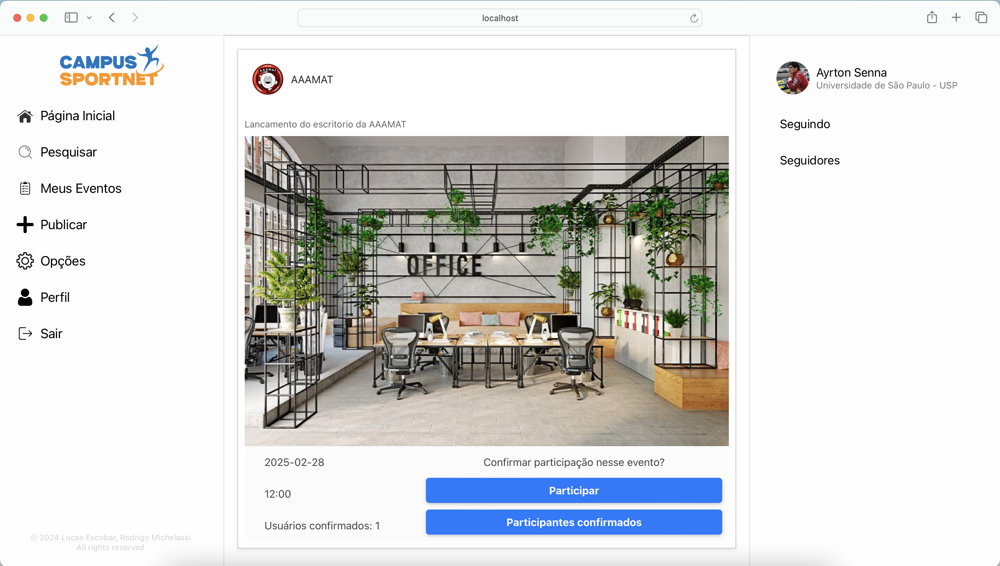
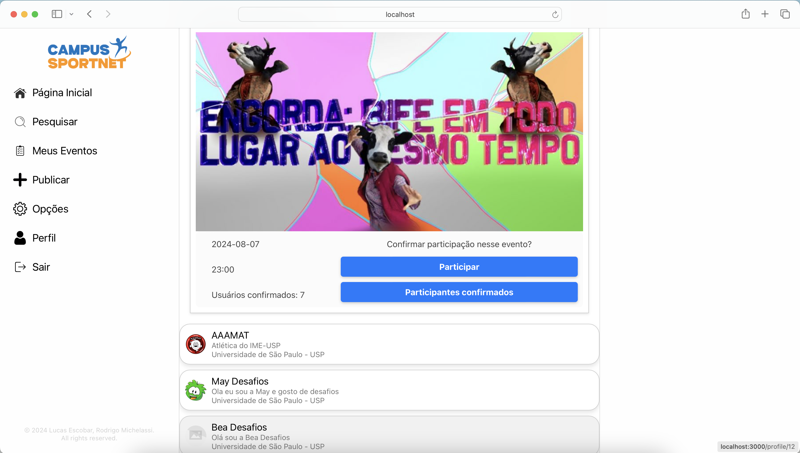
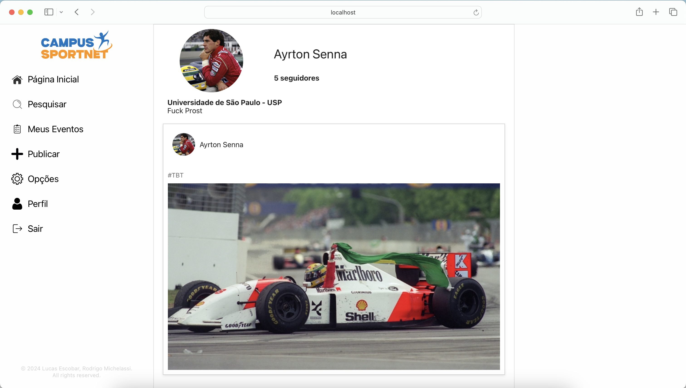
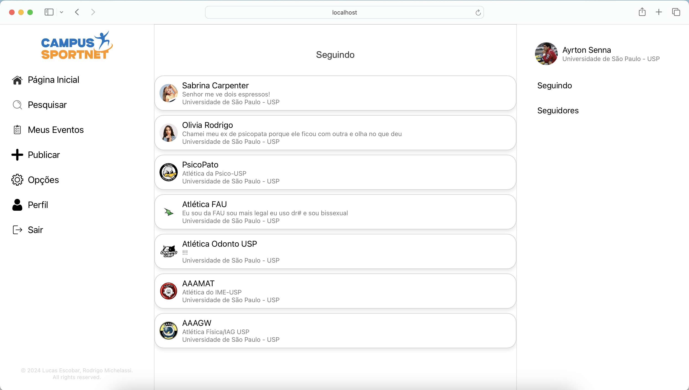

# MAC0350 Campus-SportNet ⚽


- A próxima tendência para atletas e torcedores das mais badaladas universidades brasileiras. 
- Cansado de perder um jogo de sua atlética?
- Cadastre sua conta e não perca mais nenhum evento!
- Participe de festas, jogos e saiba de tudo que ocorre na vida universitária
- Cadastre sua conta e junte-se a essa comunidade 🥇

<h2>Infinitas possibilidades</h2>

No Campus-SportNet você poderá se conectar com seus amigos e atléticas favoritas, para nossas universidades cadastradas, e ficar sabendo de eventos que irão ocorrer. Desde festas universitárias, jogos, campeonatos, seminários, etc. O networking vai além da experiência acadêmica! Se cadastre e junte-se a essa nova rede social, que vem conquistando membros em diversas Universidades brasileiras.

<h2>Explore o que seus amigos estão fazendo</h2>
<p align="center">
  
</p>

<h2>Participe e veja participantes de eventos</h2>
<p align="center">
  
</p>

<h2>Monte seu perfil</h2>
<p align="center">
  
</p>

<h2>Consulte quem você segue e seus seguidores</h2>
<p align="center">
  
</p>

<h2>Tecnologias</h2>

<a href="https://react.dev" target=”_blank”></a>
<a href="https://ktor.io" target=”_blank”></a>
<a href="https://www.postgresql.org" target=”_blank”></a>

<h2>Execução</h2>

<h3>Para executar o front-end, utilize: </h3>

```
cd csn-react-front
npm start
```

<h3>Para executar o back-end, digite:</h3>

```
cd campus-v2
idea .
```

<p>Ao abrir o IntelliJ Idea, o programa pode ser executado com o botão de execução, no canto superior direito Ao configurar um banco de dados local com PostgreSQL na sua máquina, e modificando os parâmetros necessários de login e senha no código do back-end (caso você não saiba como fazer isso, pode encontrar um tutorial nas referências, ao fim desse arquivo), você está pronto para enviar requisições e popular o banco de dados. Seguem alguns exemplos:</p>

<h2>Referências</h2>

1. [Setup PostgreSQL with MacOS and PGAdmin](https://www.sqlshack.com/setting-up-a-postgresql-database-on-mac/)
2. [Setup PostgreSQL with Linux and PGAdmin](https://www.cherryservers.com/blog/how-to-install-and-setup-postgresql-server-on-ubuntu-20-04)
3. [SQL Integration with KTOR](https://blog.stackademic.com/guide-to-sql-database-integration-with-ktor-applications-c6cb52e6c346)
4. [ReactJS Integration with KTOR](https://www.freecodecamp.org/news/how-to-consume-rest-apis-in-react/)
5. [Login Authentication on React Applications](https://www.digitalocean.com/community/tutorials/how-to-add-login-authentication-to-react-applications)
6. [React Router: Optional Parameters](https://www.digitalocean.com/community/tutorials/react-react-router-optional-parameters)

<h2>Créditos</h2>

- Lucas Escobar
- Rodrigo de Castro Michelassi

Instituto de Matemática e Estatística da Universidade de São Paulo (IME-USP), 2024
